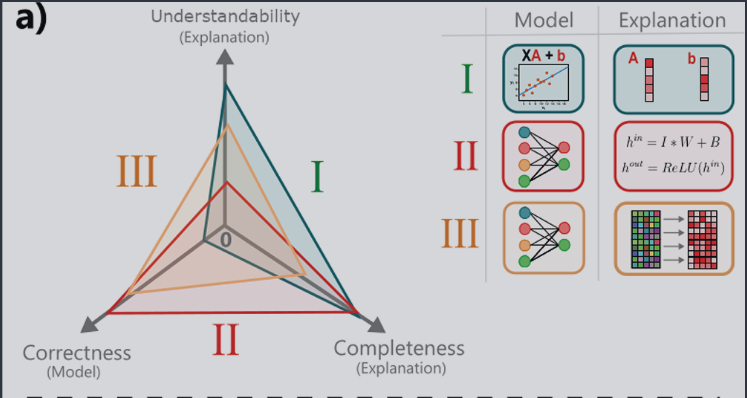
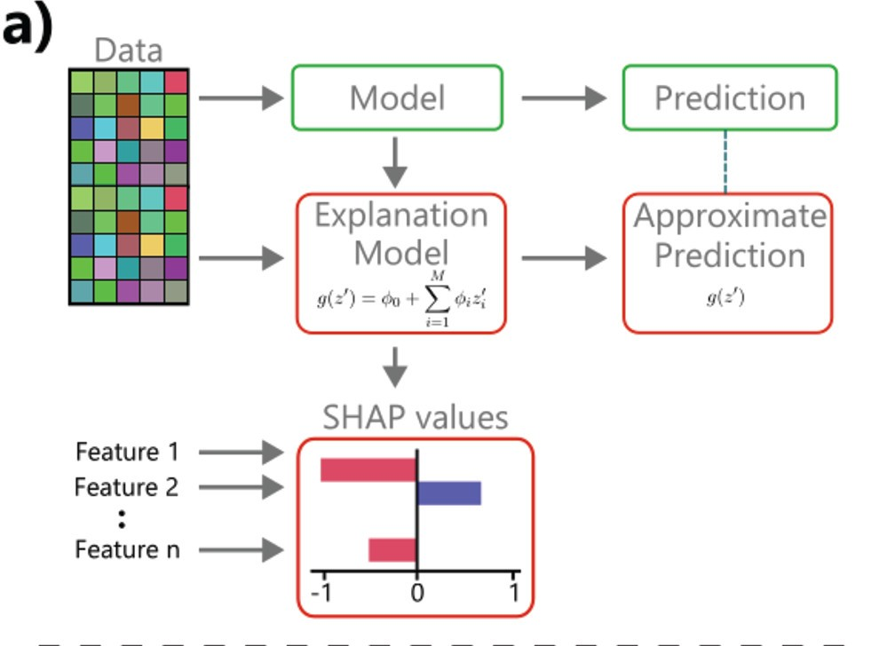

# Explainable AI

These are some of my opinions and ideas after reading [Interpretable and Explainable Machine Learning for Materials Science and Chemistry][Account] (2022), and [Explaining Explanations: An Overview of Interpretability of Machine Learning][arxiv] (2019).

A very interesting experiment in terms of explainability was <https://distill.pub>.

--------------------

## Explanations

Scientific models are expected to be explainable; that is, an expert human can respond to _why_ questions about it.

And yet, deep learning models' operation remains opaque.
So how can we explain deep-learning models? That is what this blog explores.

(Admittedly, in some cases we may be satisfied with the predictive power alone.)

### Definition and characteristics

_Explanation_ can be defined in an intuitive way. First, phrase what we want to know as a "Why question", the answer is a candidate-explanation. Keep asking "Why" until satisfied. Call the process an explanation.

We can characterise explanations using:

- _Simplicity_: how easy to understand the explanation is. (The opposite term, _complexity_, could be used as well.)
- _Completeness_: how accurately it describes the model's behaviour.

Completeness v. Simplicity tradeoff.

This tradeoff isn't universal but just a common case. Some phenomena are simple, in which case both characteristics are high.

### Correctness
This isn't a characteristic of explanations, but of a model, yet it is often correlated, as represented below (_understandability_ replaces _simplicity_):

 <!--other classes: w220, w420-->
    
    

    Image from <a href="https://pubs.acs.org/doi/10.1021/accountsmr.1c00244">paper</a> under <a href="https://creativecommons.org/licenses/by/4.0/">CC-BY-SA 4.0</a>
    

## Strategies

We consider strategies that can help explain models' operations.
First, Deep Learning (DL) intrinsic and extrinsic methods. Then the same is done for Classical ML.

### DL / Intrinsic or Representation

Interpret the learnt representations and data inside the model (i.e intrinsic). _What information does the network contain?_

They classify these at the level of Layer, Neuron, and Vector.

- Role of Layers: for example, transfer learning, reusing output of some layers for another task.
- Role of Units: "visualizations of the input patterns that maximize the response of a single unit or quantitatively, by testing the ability of a unit to solve a transfer problem" ([source][arxiv]).
- Role of Vectors: for example using Concept Activation Vectors framework.

### DL / Extrinsic or Processing

How the model processes an input (extrinsic).

- Linear Proxy Models: fit a simpler model to the neighbourhood of an input (+ noise), i.e $g(z) \approx f(z)$ around some $z$. For example, LIME or Generalised Linear Models (GLMs).

- Salience Maps: aim to explain which portions of the computation (original model) are most important for different inputs.

- Validity Interval Analysis: another technique fitting the NN behaviour to try to extract explanations.

- Principal Component Analysis, Independent Component Analysis, Non-negative Matrix Factorisation can all help as well. But in a way this is better done by architectures with disentangled representations.

### Explanation-Producing systems

Architectures designed to make explaining part of their operation easier.

- Using Explicit Attention: An attention layer/mask learns how parts of an input embedding pay attention to other parts. The layer is somewhat interpretable. In chemistry, it could learn which atoms connect (or pay attention to) other atoms.

- Dissentangled Representations: "Disentangled representations have individual dimensions that describe meaningful and independent factors of variation." ([source][arxiv]). Examples of architectures are Beta-VAE, INFOGan, capsule networks.

### Classical ML / Intrinsic

For an example of Classical ML think of Support Vector Regression, and other kinds of regressions.

These focuses on the math (internal structure).

- Simplifying the model (when possible)
    - Regularisation Approaches (SISSO, LASSO) can help by identifying the most important descriptors to use.
    - LASSO: removes tightly correlated features (leaving the most helpful one).

### Classical ML / Extrinsic

These study the model's behaviour, as a black box. Most below, correlate changes in input-features with changes in outputs.

- Partial Dependence Plots (PDPs). Though it masks possible correlations between features (if all are kept constant but one).
- Individual Conditional Expectations (ICE) overcomes the limitation above.
- Feature Importance methods: partial derivative of an output w.r.t some input feature.[^1]
- Shapley Analysis: involves fitting a linear model using nearby input-points.
    - We get insight on which features are locally relevant, by looking at the accompanying coefficients.
    - The coefficients quantify the effect of each feature in the output. I assume they fit different models to different areas of their input space, and then analyze the distribution of coefficients?
- Counterfactual Analysis

 <!--other classes: w220, w420-->
    
    

    LGM ($g$ function) and Shapley's feature contribution. Image (cropped) from <a href="https://pubs.acs.org/doi/10.1021/accountsmr.1c00244">paper</a> under <a href="https://creativecommons.org/licenses/by/4.0/">CC-BY-SA 4.0</a>
    

[Account]: https://pubs.acs.org/doi/10.1021/accountsmr.1c00244
[arxiv]: http://arxiv.org/abs/1806.00069
[CC BY 4.0]: https://creativecommons.org/licenses/by/4.0/
[^1]:  This I think can be done also numerically, without actually calculating the derivative. See refs 20 and 21 in the paper for more detail.
