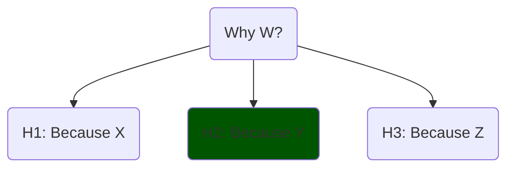

# What is an explanation?

One simple definition of an explanation is:

> An answer to a why-question that accounts for the cause of an event.

Although not only _why-questions_ prompt explanations.

[Explanation in artificial intelligence: insights from the social sciences][explanations_social]&mdash;section 2.1.2, characterises an explanation as:

A **cognitive process**, which involves finding the cause of an event, known as the _causal attribution_. A **product**, resulting from the cognitive process. A **social process**, which involves communicating the product.

Let's expand on these characteristics.

## Cognitive process

This process involves assigning _causes_ to events &mdash;known as _causal attribution_&mdash; and _abductive reasoning_.

### Causes

Aristotle proposed 4 kinds of _causes_ that pick on different aspects to answer a _why-question_ (part of explaining): Efficient (a mechanism), Final (a purpose), Formal (structure or form), Material(constitution).

These explanations are not always exclusive, they can be complementary.

Hume understood _causes_ through _counterfactuals_: A is the cause of B if, had A not happened, B wouldn't have happened. This view was formalised by Pearl and Halpern.

_Are all Aristotelian causes Humean causes?_ The one that best fits the definition is the _efficient_ cause; the rest are not naturally understood as events so they don't easily fit as counterfactuals.

In science, _effective causes_ and _counterfactuals_ are most useful. But in everyday life, all Aristotelian causes are used.

In addition, [Explanation in AI: insights from the social sciences][explanations_social] notes that _why-questions_ are usually contrastive questions, phrased as _why P rather than Q_ instead of _why P_. In this latter case, the _foil_ (Q) is implicit.

### Abductive Inference

Causal attribution is closely related to abductive inference. Abduction is 3-step process, not too different from the scientific process itself:

1. Propose hypothetical causes (or chains of causes, meaning a series of causally connected events), this is a creative process
2. Select the best given the available evidence; this filtering process is dependent upon prior knowledge,
3. Maintain until contradicted by experience or super-seeded (e.g. by a simpler explanation).

The plausibility of a hypothesis or causal claim is affected by different aspects, such as:

- Its _simplicity_: if it involves a shorter chain of causes, it is preferred,
- Its _generality_: if it explains other cases, it is preferred,
- Fits prior knowledge (or beliefs): if so it is preferred; if it contradicts many other patterns it may be rejected.

I don't have much to say about _product_ (`2.`), so we jump to `3`.

## Social Process

The causal-hypothesis must then be communicated, and there are expectations about it.

[Gricean Maxims][gricean_maxims] are rules observed in _good_ communication. We can use these rules as a guide for good _model explanations_ as well.

1. **Informative** (Quantity): right amount of context and details,
2. **Truthful** (Quality, or Fidelity): Try to make it true,
3. **Relevance** (Relation): do not state things that aren't needed (provide insight),
4. **Manner** (clarity): express it in elegant terms.

## A complete example

> [!Note]
> You open a drawer, and it slides out. A friend asks: Why did the drawer slide out?

Notice that the _foil_ is implicit; _slide rather than staying at rest?_ We must guess it, or ask further clarifications.

> You: It slides because a force was applied on it. Without the force, it stays at rest.

That is an _efficient cause_.

> Friend: But why does it _slide_?
> You: Do you mean slide rather than opening like (as a lid)?
> The rails allow it to slide out; to open like a lid it would need hinges or other system.

Or "You" could say: Had the rails not been there, the drawer wouldn't have slide.

This a _formal_ cause, based on the form. It is also clear that it is a _contrastive explanation_. The other causes would be used in answers like "Why did it burn? Because it's made of wood (Material); or because they wanted to get rid of it (Final)."

The friend could recursively ask "Why" and finally reject or accept the explanation (or remain sceptical).

The _social process_ of guessing the friend's actual _knowledge gap_, assumptions, intentions, is also clear, besides the _cognitive_ task.

## Metaphors: The Machine and The Agent

In the scientific and science-adjacent domains, models are conceptualised as _machines_:

1. They have parts, each with a function, a role,
2. They correspond with some aspect of the reality being modelled.

Outside of science or the technical domain, they're conceptualised as _human-like agents_:

1. They tend to be explained in human terms,
2. They are expected to be reliable, consistent, ...

So explanations are answers to _why-questions_; _good_ explanations respect the Gricean maxims, and will be dependent on the audience (their preferred style, expectations, expertise).

We could also select more metaphors and more audiences, or make divisions within each; the table below summarises key aspects.

| Perspective      | Model is a… | Preferred Explanation style           | Audience            |
| ---------------- | ----------- | --------------------------- | ------------------- |
| **Scientific**   | Machine     | Mechanistic, causal, formal | Experts             |
| **Human-facing** | Agent       | Intentional, narrative      | Users, stakeholders |

Let's now use the concepts learnt to define Explainable AI.

------------

List of sources used in this blogpost

1. [On the mechanization of abductive logic][abductive_logic] (1973). The first page is quite interesting.
<!-- A **deduction** (proof) is e.g. "All cats are animals (I); animals are big (II); then cats are big (III)", whereas **abduction** (hypothesis) would be "III; I; maybe II" notice the _maybe_ (anti-clockwise rotation). Another anti-clockwise rotation takes us to **induction** (generalisation,hypothesis): "II; III; maybe all I". -->
1. [A Unified Approach to Interpreting Model Predictions][shap_values] (2017): paper proposing SHAP, that is, showing Shapley values as the best coefficients in linear combination of features, given 3 requirements (local accuracy, missingness and consistency),
1. [Explaining Explanations: An Overview of Interpretability of Machine Learning][xx] (2018),
1. [Producing radiologist-quality reports for interpretable artificial intelligence][xai_rnn_radiology] (2018): a "case study",
1. The paper ["Explanation in artificial intelligence: insights from the social sciences"][explanations_social] (2019, 38 pages). Once the why-cause is found (diagnosis), it may be communicated, making rules of conversation relevant: [Gricean Maxims of Communication][gricean_maxims] (blog-post), or [Wikipedia's][wikipedia_gricean].
   - The definition of explanation extends previous work by Lombrozo on [The structure and function of explanations][lombrozo].
1. [The perils and pitfalls of explainable AI: Strategies for explaining algorithmic decision-making][perils_and_pitfalls] (2021): emphasis on socio-political aspects,
1. [Interpretable and Explainable Machine Learning for Materials Science and Chemistry][xai4mat] (2022),
1. Blog Posts: [What is Explainable AI?][what_is_xai] (2022) and from [IBM][xai_ibm],
1. [A Perspective on Explainable Artificial Intelligence Methods: SHAP and LIME][using_shap_lime] (2024).

<!-- Also, a very interesting experiment in terms of explainability was <https://distill.pub>. -->

[xai4mat]: https://pubs.acs.org/doi/10.1021/accountsmr.1c00244
[using_shap_lime]: https://onlinelibrary.wiley.com/doi/abs/10.1002/aisy.202400304
[xx]: http://arxiv.org/abs/1806.00069
[shap_values]: https://proceedings.neurips.cc/paper/2017/hash/8a20a8621978632d76c43dfd28b67767-Abstract.html
<!-- [XAI for whom]: http://arxiv.org/abs/2106.05568 -->
[what_is_xai]: https://www.sei.cmu.edu/blog/what-is-explainable-ai/
[xai_ibm]: https://www.sei.cmu.edu/blog/what-is-explainable-ai/
[xai_rnn_radiology]: https://arxiv.org/abs/1806.00340
[perils_and_pitfalls]: https://www.sciencedirect.com/science/article/pii/S0740624X21001027
[abductive_logic]:https://www.ijcai.org/Proceedings/73/Papers/017.pdf
[explanations_social]: https://www.sciencedirect.com/science/article/pii/S0004370218305988
[gricean_maxims]: https://effectiviology.com/principles-of-effective-communication/
[wikipedia_gricean]: https://en.wikipedia.org/wiki/Cooperative_principle
[lombrozo]: https://fitelson.org/few/few_08/lombrozo_reading.pdf
