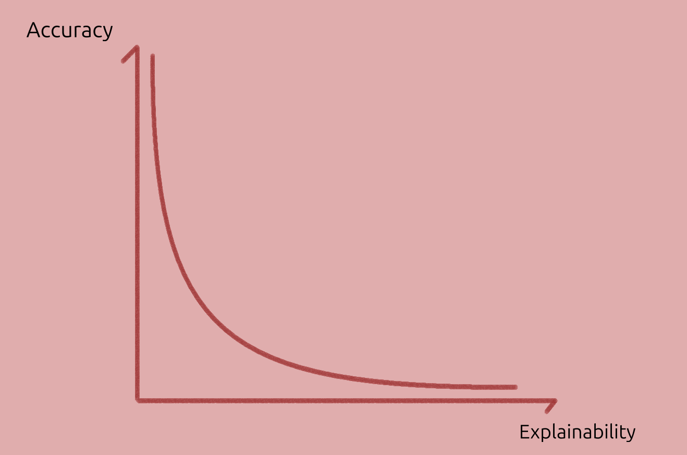
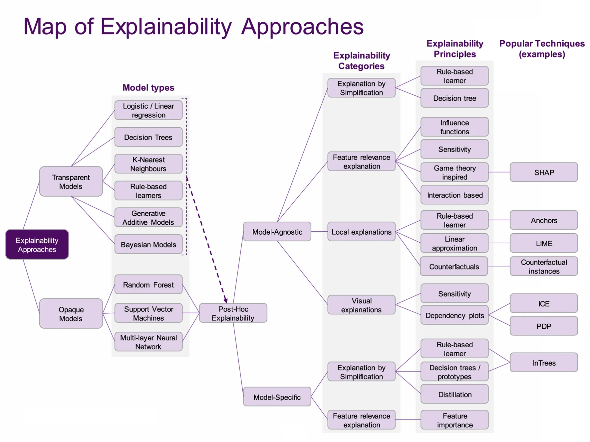

# Explainable AI - Concepts

I like to define the discipline of **Explainable Artificial Intelligence** (XAI) as:

> XAI aims to explain _why_ a model makes certain predictions and _how_ it operates.

Then, we can define **model explainability** as:
> Model explainability is the degree to which we can answer those questions about a model, either directly or using explainability methods.

## Explainability - Accuracy Trade-off

This trade-off is not universal. Simple models such as linear regression or decision trees are fully explainable, but they are also quite limited.

More complex and accurate models tend to be less explainable, as conceptually shown below:

    
    
Model accuracy vs Model explainability tradeoff.

## Dimensions of interest

Here, we emphasise two _model explanation_ dimensions:

- **Complexity** : how hard or how much expertise is needed to understand the explanation.
- **Insight** : how much the explanation empowers users to understand the model, either intuitively or quantitatively. _How does the output change_ if we change this or that feature? _Does it fail in some specific cases_?

And one _model_ dimension:

- **Accuracy** (model): DL models are usually accurate and complex, and have low _intrinsic_ explainability. Yet, they may allow for insightful _extrinsic_ explanations. For a model, accuracy, predictive power and complexity are also inter-related.

Complexity-Insight-Accuracy trade-off:

    
    

    Dimensions of interest linked in a radial plot. The image was altered from <a href="https://pubs.acs.org/doi/10.1021/accountsmr.1c00244">paper</a> under <a href="https://creativecommons.org/licenses/by/4.0/">CC-BY</a>.
    

We can lump together other, less important, dimensions:

- **Other variables**: intrinsic-global, intrinsic-local, extrinsic-global, and extrinsic-local explanations. For a given category from the 4 above, we can think of explainability as $X_p = \frac{I}{C}$ or plain words: e**X**plainability equals **I**nsight divided by **C**omplexity.

## Map of XAI

An interesting map of XAI is given in the survey [Principles and practice of explainable ML][principles_and_practice] (2021); and is reproduced below:

    
    

    Image from <a href="https://www.frontiersin.org/journals/big-data/articles/10.3389/fdata.2021.688969/full">paper</a> under <a href="https://creativecommons.org/licenses/by/4.0/">CC-BY</a>
    

Most _classic ML_ models are in the dashed area under **Model types** column.

These are _transparent_ (intrinsically explainable) but _may_ also benefit of post-hoc (post training) explanations, such as visualising it. When transparency is key and the predictions are accurate enough, these may be preferred.

The focus here though, is explaining _deep learning_ models.
These are usually _opaque_ or "_black-boxes_", but their predictive power is usually higher than classic ML models.

In other words, there are use-cases for each classical and deep learning _models_.

When using explanation techniques, we should remember that (same paper):

> Relying on only one technique will only give us a partial picture of the whole story, possibly missing out important information. Hence, combining multiple approaches together provides for a more cautious way to explain a model. (...) At this point we would like to note that there is no established way of combining techniques (in a pipeline fashion),

## Explanation kinds

The survey [Principles and practise of explaining ML models][principles_and_practice] also includes a great table of **explanation kinds**.
A modified version of the table is below:

| Explanation         | Advantages    | Disadvantages | Question |
|---------------------|---------------|---------------|----------|
| **Local explanations** | Explains the model's behaviour in a local area of interest. Operates on instance-level explanations. | Explanations do not generalize on a global scale. Small **perturbations** might result in very different explanations.| How do small perturbations affect the output / prediction? |
| **Examples**      | Representative items for each class provide insights about the model's internal reasoning. | Examples require human selection. They do not explicitly state what parts of the example influence the model. | How do inputs from different classes compare? And same? |
| **Feature relevance** | They operate on an instance level (some can operate globally). | Methods may make assumptions which do not hold (e.g. feature independence, linearity).| Which input features are most important? |
| **Simplification**  | Simple surrogate models explain opaque ones. | Surrogate models may not approximate original models well. | Can we get local insights by using a simpler model? |
| **Visualizations**  | Easier to communicate to non-technical audiences. Most approaches are intuitive and not hard to implement. | There is an upper bound on how many features can be considered at once. Humans must inspect plots to derive explanations. | Class boundaries? |

Let's now look at methods.

--------------------

Sources

1. [A Unified Approach to Interpreting Model Predictions][shap_values] (2017): paper proposing SHAP, that is, showing Shapley values as the best coefficients in linear combination of features, given 3 requirements (local accuracy, missingness and consistency),
1. [Explaining Explanations: An Overview of Interpretability of Machine Learning][xx] (2018),
1. [Producing radiologist-quality reports for interpretable artificial intelligence][xai_rnn_radiology] (2018): a "case study",
1. [Principles and practice of explainable machine-learning][principles_and_practice] (2021, 25 pages): Sections 8&ndash;11 are a useful review of explainability methods.
1. [The perils and pitfalls of explainable AI: Strategies for explaining algorithmic decision-making][perils_and_pitfalls] (2021): emphasis on socio-political aspects,
1. [Interpretable and Explainable Machine Learning for Materials Science and Chemistry][xai4mat] (2022),
1. Blog Posts: [What is Explainable AI?][what_is_xai] (2022) and from [IBM][xai_ibm],
1. [A Perspective on Explainable Artificial Intelligence Methods: SHAP and LIME][using_shap_lime] (2024).

<!-- Also, a very interesting experiment in terms of explainability was <https://distill.pub>. -->

[xai4mat]: https://pubs.acs.org/doi/10.1021/accountsmr.1c00244
[using_shap_lime]: https://onlinelibrary.wiley.com/doi/abs/10.1002/aisy.202400304
[xx]: http://arxiv.org/abs/1806.00069
[shap_values]: https://proceedings.neurips.cc/paper/2017/hash/8a20a8621978632d76c43dfd28b67767-Abstract.html
<!-- [XAI for whom]: http://arxiv.org/abs/2106.05568 -->
[what_is_xai]: https://www.sei.cmu.edu/blog/what-is-explainable-ai/
[xai_ibm]: https://www.sei.cmu.edu/blog/what-is-explainable-ai/
[xai_rnn_radiology]: https://arxiv.org/abs/1806.00340
[perils_and_pitfalls]: https://www.sciencedirect.com/science/article/pii/S0740624X21001027
[principles_and_practice]: https://www.frontiersin.org/journals/big-data/articles/10.3389/fdata.2021.688969/full
