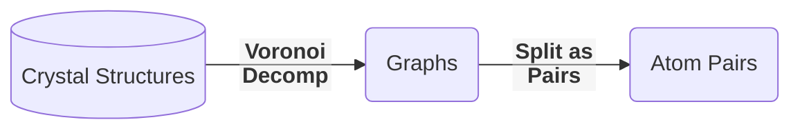
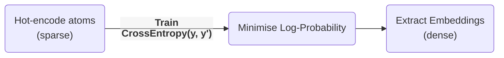

# Learning embeddings for atoms

These are some of my opinions and ideas after reading [Distributed representations of atoms and materials for
machine learning][Nature] (2022).

-----------

## Summary

The paper proposes an unsupervised learning approach to learn atom-embeddings called SkipAtom, in reference to the Skip-gram algorithm.

SkipAtom involves training one atom to predict its most common neighbours.

Combining atom-emdeddings, compound embeddings can be created, which are useful for property prediction neural networks (NNs).

## Use cases

This approach is especially useful when the structure of a compound is unknown. Otherwise, approaches incorporating structural information are more accurate (on average) at most tasks.

## Analogy to Skip-gram

* Skip-gram: Unsupervised learning is project hot-encoded word-tokens to a dense, lower-dimensional vector, then decoding it.

* SkipAtom: Project hot-encoded atoms to a dense, lower-dimensional vector, then decoding it.

The analogies are that _words are like atoms_, and _sentences are like compounds_.

> [!NOTE]
> This approach is attractive because the algorithm is unsupervised i.e. it does not rely on labelled data.

## High-Level procedure

The process followed is first retrieve compounds and generate atom-pair-datasets:

And next train two projection layers:

* Embeddings from similar environments result in close vectors (e.g. $\mathrm{C}$, $\mathrm{N}$, $\mathrm{O}$,..).
* The representation is now dense and the vector space is ordered/semantic.
* The architecture is described as:
    > (...) single hidden layer with linear activation, whose size depended on the desired dimensionality of the learned embeddings, and an output layer with 86 neurons (one for each of the utilized atom types) with softmax activation. (...) minimizing the cross-entropy loss between the predicted context atom probabilities and the one-hot vector representing the context atom, given the one-vector representing the target atom as input. Training utilized stochastic gradient descent with the Adam optimizer, with a learning rate of $10^{−2}$ and a mini-batch size of 1024, for
    ten epochs.

## Embeddings

An embedding can be thought of as a descriptor, where each dimension of it is a property like electronegativity, mass. However, dimensions needn't to map to a real property.

If, for example, some dimension increases as `C<N<O<F..` (and for the next periods), a hypothesis could be that it encodes electronegativity.

Other experiments could: optimise the dimensionality of the embedding vector; plot the distribution using dimensionality reduction or PCA to further reduce it to 2-3 components.

### Ways to create embeddings

Which ways are there to create vector-embeddings of atoms?

| Random | One-Hot | Atom2Vec | Mat2Vec | SkipAtom|
|--------|---------|----------|---------|----------|
| From Random Distributions  | One 1, rest 0s | SVD of Co-Occurence Matrix      | Embedding (Word2Vec)| Embedding (Skip-gram) |
| $(0.4,\ldots,0.6)$ | $(0,\ldots,1,\ldots,0)$|- | - | -|
|dense|sparse|sparse|dense|dense|

**Comments**

* Atom2Vec: any matrix (square or not) has SVD; but does this improves over co-occurences vector?
* Mat2Vec: The projection matrix, initially random, ends up storing embeddings.
    * Task: context-words predict centre-word. Example: `The cat ___ on the mat.`
* SkipAtom: In the same paper of Word2Vec there is the Skip-gram algorithm, which is adapted for chemistry in this paper.
    * Task: centre-word predicts context-words. Example: `___ ___ sat __ ___ ____` (same sentence).

### Combining atom embeddings (pooling)

Atom-embeddings can be combined (pooled) into a single vector representing a compound.

Vector-pooling options are:
* _sum_: $\sum s_i \vec{a}_i$ where $s_i$ is the stoichiometry (can be fractional),
* _mean_: $\frac{\sum s_i \vec{a}_i}{\sum s_i}$, i.e. divided by total number of atoms (can be fractional too).
* _max_: $\mathrm{max}(M_i)$, reduces material matrix $\mathrm{M}$ to vector. Selects max value of each column, each row being an atom in the compound.

The resulting compound embedding is then used for training a feed-forward NN on different tasks. Also benchmarked using MatBench.

The pooling can also be done with hot-encoded versions rather than embeddings as in *ElemNet* (mean pooling), where the result is a sparse vector; or in Bag-of-atoms (sum pooling).

## When it's useful

On the on hand, similar compounds will have similar vectors, which is useful; on the other hand, all isomers have the same vector, which is a limitation of what this method can express.

With this model, having just the material's composition but not its structure, we can still try to calculate some properties.

The model does use connectivity information to train it (just the pairs, without any extra data like distance or angles). But the model just needs the formula at inference time (and does fine with non-stoichiometric solids).

Another reason why it matters is that, apparently, calculating a property of interest using DFT is computationally expensive, and this could be faster. They claim that DFT also has challenges with systems with strongly correlated electrons, or high levels of disorder (unsure what this means).

[Nature]: https://www.nature.com/articles/s41524-022-00729-3
