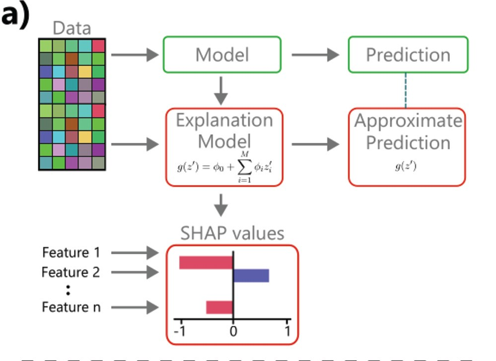

# Explainable AI for chemistry

I've recently read the paper titled [Interpretable and Explainable Machine Learning for Materials Science and Chemistry][Account] (2022).

I write some thoughts about it below.

## Introduction

Scientist strive to explain the world. When a mathematical description or model is proposed, it is expected to be interpretable. By _interpretable_ we mean understood by a human, both mathematically and conceptually.

A conceptual level generally means that we explain it using terms from the domain of applicability of the model. Here are two examples:

* In chemistry, this could be electronegativity or mass.
* In physics, if we take a Hamiltonian, we can talk about the kinetic energy term, the electric potential term, and so on. We can also understand its mathematical structure as part of a differential equation.

### The question

ML algorithms tend to be interpretable in a general sense (a human can explain it); Deep Neural Networks (DNNs) are often considered black boxes.

But insofar as we are doing _science_ with deep learning models, it is important to understand the model itself, not just its output.

This is how we get to the question to be explored:

* How can scientists gain deeper understanding of traditional ML algorithms and DNNs?

(Admittedly, in some cases we may be satisfied with DNNs' predictive power alone.)

## Concepts

The paper defines a few concepts, I use my own terms below.

* _correctness_: how accurate the model is.
* _domainness_: extent to which the mathematical model is explained by domain concepts e.g. mass or charge.
    * If high: helps experts build confidence interpreting the outputs.

There tends to be a tradeoff between _domainness_ and _correctness_ because complex behaviour needs complex networks or models, to which we can rarely assign high domainness.

Also, domainness may be applied to the model (as a whole) or to outputs or comparison of outputs.

### Example

Imagine passing some inputs to the model, and then studying what happens internally and with the outputs. And maybe also correlating between outputs, and between outputs and inputs and so on.

They cite as an example the compatibility of some NN with the Penn model of dielectrics (potentially some of its inner working emulates the Penn model). This mapping implies high domainness.

## Explaining Classical ML

As an example of Classical ML think of Support Vector Regression, and other kinds of regressions.

### Enhancing Intrinsic Explanations

Intrinsically explainable models are those we can get some understanding by looking at the math.
Hence, the techniques to enhance it are to do with the math.

* Simplifying the model (when possible)
    * Regularisation Approaches (SISSO, LASSO) can help by identifying the most important descriptors to use.
    * LASSO: to remove features when tightly correlated (leaving the most helpful one).
* Generalised Linear Models (GLMs) where the generalised model approximates the more complex model i.e $g(z) \approx f(z)$, respectively. The GLM, $g(z)$, is defined as:
    $$g(z) = \psi_0 + \sum_{i=1}^M \psi_i z_i$$

### Enhancing Extrinsic Explanations

* What-if: Correlate changes in input-features with changes in outputs.
    * Partial Dependence Plots (PDPs). Though it masks possible correlations between features (if all are kept constant but one).
    * Individual Conditional Expectations (ICE) overcomes the limitation above.
    * Feature Importance methods: partial derivative of an output w.r.t some input feature.[^1]
    * Shapley Analysis: also involves fitting a linear model around some close input points, then looking at the coefficients. The coefficients quantify the effect of each feature in the output. It seems to be derived from the GLM. (I assume they fit different GLMs to different areas of their input space, and then analyze the distribution of coefficients? I am unsure.)

The image below is from the paper, under [CC BY 4.0] (cropped), the main things to notice are the linear generalised model and the Shapley's contributions from different features (how much each feature affects the output). It seems to derive from the GLM.

 <!--other classes: w220, w420-->
    
    

    Image from <a href="https://pubs.acs.org/doi/10.1021/accountsmr.1c00244">Original Paper</a> under <a href="https://creativecommons.org/licenses/by/4.0/">CC-BY-SA 4.0</a>
    

## Explaining Deep Learning Models

### Intrinsic Explanations
* Representation Methods: Interpret the learnt representations (i.e intrinsic).
* Introducing inductive biases related to symmetry

### Extrinsic Explanations

* Processing Methods: How the model processes an input (like what-if analyses i.e extrinsic).
    * Salience methods: these are quite simple and useful, basically it's also finding a coefficient, and try to refer it back to some input feature or region (for images).
        * analyse which activations respond stronger to which features (e.g class activation map or CAM)
        * or where changes in the activations change the output the most (derivatives/gradients, grad-CAM).

Another separate avenue is using more explainable NNs like $\beta$-VAEs or transformers.

[Account]: https://pubs.acs.org/doi/10.1021/accountsmr.1c00244
[CC BY 4.0]: https://creativecommons.org/licenses/by/4.0/
[^1]:  This I think can be done also numerically, without actually calculating the derivative. See refs 20 and 21 in the paper for more detail.
