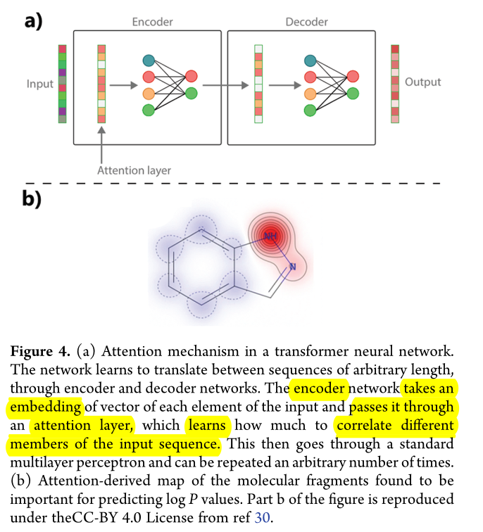

# Explainable AI

These are some of my opinions and ideas after reading [Interpretable and Explainable Machine Learning for Materials Science and Chemistry][Account] (2022), and [Explaining Explanations: An Overview of Interpretability of Machine Learning][arxiv] (2019).

A very interesting experiment in terms of explainability was <https://distill.pub>.

--------------------

## Explanations

Scientific models are expected to be explainable; that is, an expert human can respond to _why_ questions with it and about it.

And yet, deep learning models' operation remains opaque.
So how can we explain deep-learning models? That is what this blog explores.

(Admittedly, in some cases we may be satisfied with the predictive power alone.)

### Definition and characteristics

_Explanation_ can be defined in an intuitive way. First, phrase what we want to know as a "Why question", the answer is a candidate-explanation. Keep asking "Why" until satisfied. Call the process an explanation.

We can characterise explanations using:

- _Simplicity_: how easy to understand the explanation is. (The opposite term, _complexity_ could be used as well.)
- _Completeness_: how accurately it describes the model's behaviour.

Completeness/Simplicity tradeoff graph.

>[!NOTE]
> This isn't universal but just a common case. Some phenomena are simple, and both characteristics are high.

A related dimension is _correctness_, which does not belong to explaining a model, but is of high importance. A 3D radar plot is included in the linked above, and reproduced below (_simplicity_ maps to _understandability_):

 <!--other classes: w220, w420-->
    
    

    Image from <a href="https://pubs.acs.org/doi/10.1021/accountsmr.1c00244">Original Paper</a> under <a href="https://creativecommons.org/licenses/by/4.0/">CC-BY-SA 4.0</a>
    

Let's consider strategies that can help explain models operations.

### Strategies fo Classical ML models

As an example of Classical ML think of Support Vector Regression, and other kinds of regressions.

#### Intrinsic methods

This focuses on the math (internal structure).

- Simplifying the model (when possible)
    - Regularisation Approaches (SISSO, LASSO) can help by identifying the most important descriptors to use.
    - LASSO: to remove features when tightly correlated (leaving the most helpful one).

#### Extrinsic methods

This focuses on its behaviour: its outputs, input-outputs relationships, and so forth.

- Correlate changes in input-features with changes in outputs.
    - Partial Dependence Plots (PDPs). Though it masks possible correlations between features (if all are kept constant but one).
    - Individual Conditional Expectations (ICE) overcomes the limitation above.
    - Feature Importance methods: partial derivative of an output w.r.t some input feature.[^1]
    - Shapley Analysis: involves fitting a linear model using nearby input-points.
        - We get insight on which features are locally relevant, by looking at the accompanying coefficients.
        - The coefficients quantify the effect of each feature in the output.
        - It seems to be derived from the GLM. (I assume they fit different GLMs to different areas of their input space, and then analyze the distribution of coefficients? I am unsure.)
    - Counterfactual Analysis: I did not follow this one, so I skip it. However, counterfactuals are hypotheticals like: X wouldn't have happened hadn't Y not happened.

The image below is from the paper, under [CC BY 4.0] (cropped), the main things to notice are the linear generalised model and the Shapley's contributions from different features (how much each feature affects the output). It seems to derive from the GLM.

 <!--other classes: w220, w420-->
    
    

    Image from <a href="https://pubs.acs.org/doi/10.1021/accountsmr.1c00244">Original Paper</a> under <a href="https://creativecommons.org/licenses/by/4.0/">CC-BY-SA 4.0</a>
    

### Strategies for Deep Learning Models

This is the interesting part at present (2026), although the paper attention is split between deep learning and classical machine learning, so there isn't very much about deep learning.

The paper mentions the _processing_ and _representation_ approaches. These concepts map to "what ifs" (or extrinsic) and "looking inside the model" (intrinsic).

#### Intrinsic or Representation methods

Interpret the learnt representations and data inside the model (i.e intrinsic). _What information does the network contain?_

- Introducing inductive biases related to symmetry.

#### Extrinsic or Processing methods

How the model processes an input (extrinsic).

_Linear Proxy Models_: LIME, or Generalised Linear Models (GLMs) to approximate the more complex model i.e $g(z) \approx f(z)$, respectively. The GLM, $g(z)$, is defined as:
    $$g(z) = \psi_0 + \sum_{i=1}^M \psi_i z_i$$

_Salience Methods_ or _Class Activation Maps_ (CAMs): Finding which filters are most sensitive to which features or image regions.

_Validity Interval Analysis_: another technique fitting the NN behaviour to try to extract explanations.

#### Explanation-Producing systems

We can still apply previous methods, but these architectures are designed to make explaining part of their operation easier, so they deserve a separate section.

Attention-based approches: this is very similar to salience methods. I expand below.

The paper mentions transformers as well. A transformer operates upon an embedding, for example an atom vector, and learns which parts pay attention to other parts. These are called _attention masks_.

A good explanation is provided as an image (highlights are mine):

 <!--other classes: w220, w420-->
    
    

    Image from <a href="https://pubs.acs.org/doi/10.1021/accountsmr.1c00244">Original Paper</a> under <a href="https://creativecommons.org/licenses/by/4.0/">CC-BY-SA 4.0</a>
    

The paper continues (bold is mine):

> These representations, known as _attention masks_, can be **interpreted in similar way to salience maps and determine sections of the input data that a model exploits for making predictions**. The authors of a transformer model trained on chemical reaction data were able to perform atom-mapping and learn chemical grammars, i.e., identify atoms during a chemical reaction, by interpreting its learned attention map.

Finally the paper warns us:

Both $\beta$-VAEs or transformers are considered quite explainable models.

[Account]: https://pubs.acs.org/doi/10.1021/accountsmr.1c00244
[arxiv]: http://arxiv.org/abs/1806.00069
[CC BY 4.0]: https://creativecommons.org/licenses/by/4.0/
[^1]:  This I think can be done also numerically, without actually calculating the derivative. See refs 20 and 21 in the paper for more detail.
